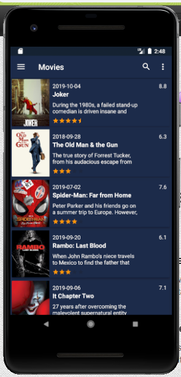
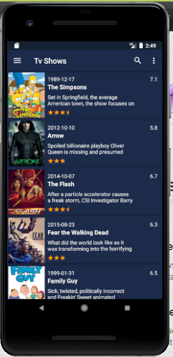
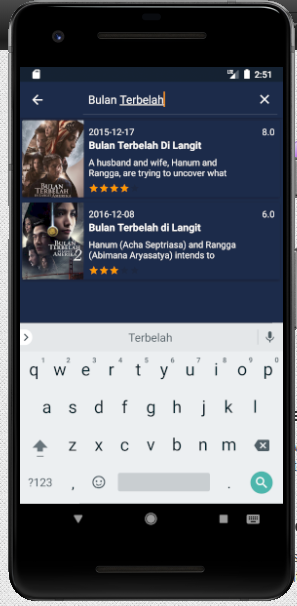
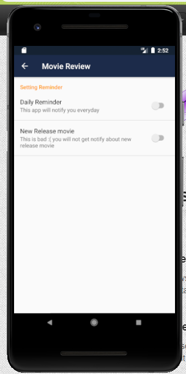
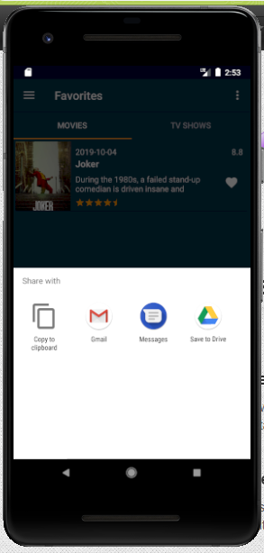
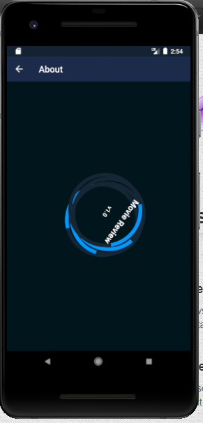

## Movie Review or Catalog Movie

This Movies or Tv Shows application is an application that was created using Kotlin programming language and using MVP pattern.
everyone can download, modified and use it for personal purposes only this is not for commercial. Open source project

This application consist of some feature and you can read it from below :

1. Screen flash
2. Movie Fragment to show list of movies
3. Tv Shows Fragment to show list of tv serial
4. Favorite Fragment to save favorite movie and tv
5. Searching feature for searching movie and tv
6. Share button to share via social media
7. Rating application button to rate the application replace it with your own
8. About application

The screenshot are below :

Movie Fragment:

TvShow Fragment:

Favorite Fragment:

Searching:

Reminder:

Share:

Rating:

About Application:

